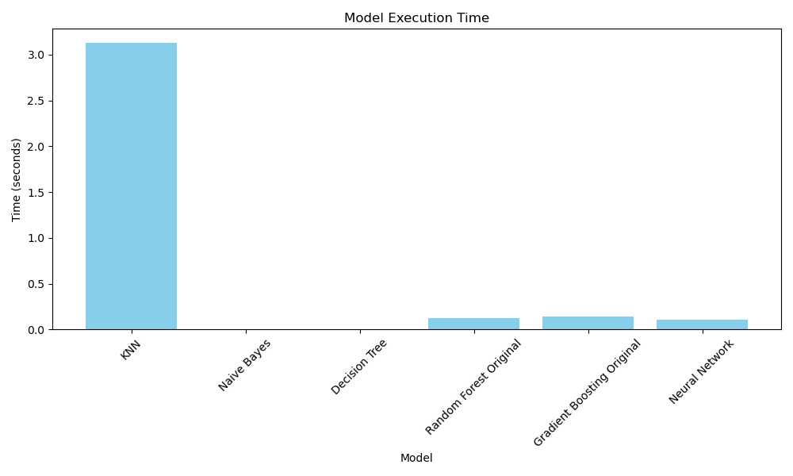
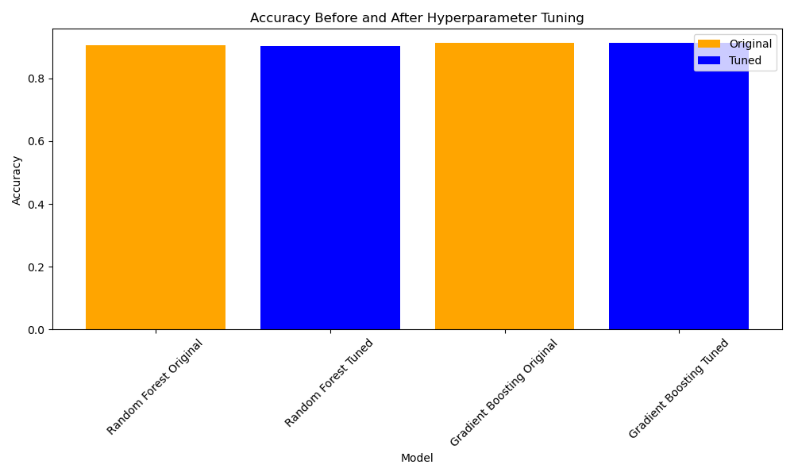

# Cancer Prediction

This project involves building and evaluating various machine learning models to predict cancer outcomes based on a dataset. The models used include K-Nearest Neighbors (KNN), Naive Bayes, Decision Tree, Random Forest, Gradient Boosting, and a Neural Network.

## Preprocessing

1. **Data Loading**: The dataset is loaded and inspected for missing values and inconsistencies.
2. **Imputation**: Missing numerical values are filled with the mean, and categorical values are filled with the most frequent value.
3. **Encoding**: Categorical variables, including the target variable `Status`, which is if the patient is alive or dead, are encoded into numerical values.
4. **Outlier Detection**: Outliers are detected and removed using the z-score method.
5. **Standardization**: Numerical features are standardized to have a mean of 0 and a standard deviation of 1.

## Models

1. **K-Nearest Neighbors (KNN)**: A simple model that classifies based on the majority class of the nearest neighbors. This was implemnted by scratch using the Euclidean distance.
2. **Naive Bayes**: A probabilistic model based on Bayes' theorem with strong independence assumptions. Bayes theorem is used to calculate the probability of the target variable based on the features.
3. **Decision Tree**: A model that splits data into branches to make predictions. The Gini impurity, which measures the impurity of the node, is used to calculate the best split.
4. **Random Forest**: An ensemble of decision trees, using the 'entropy' criterion for splitting. Entropy is used to calculate the information gain of the split, to mimic the C4.5 algorithm.
5. **Gradient Boosting**: An ensemble model that builds trees sequentially to improve predictions.
6. **Neural Network**: A simple feedforward neural network implemented using PyTorch.

## Hyperparameter Tuning

- **Random Forest and Gradient Boosting**: Hyperparameters were tuned using `RandomizedSearchCV` to find the best model configurations. Although, both of the models did not see much of a performance increase after tuning.

## Performance Visualizations

### Model Execution Time

This bar chart shows the execution time for each model, highlighting the computational cost associated with training and predicting with each algorithm. As expected, the KNN model, which was implemented by scratch, took the longest to execute.

### Model Accuracy

This bar chart compares the accuracy of each model, providing insight into their predictive performance on the dataset. All of the models performed very well, with the exception of the KNN model, which was implemented by scratch.

| Model            | Accuracy (%) | Execution Time (s) |
|------------------|--------------|--------------------|
| KNN              | 89.50        | 3.12               |
| Naive Bayes      | 86.17        | 0.001              |
| Decision Tree    | 84.35        | 0.007              |
| Random Forest    | 90.58        | 0.12               |
| Gradient Boosting| 91.19        | 0.14               |
| Neural Network   | 87.54        | 0.11               |

### Accuracy Before and After Hyperparameter Tuning

This chart compares the accuracy of the Random Forest and Gradient Boosting models before and after hyperparameter tuning, illustrating the impact of tuning on model performance. As you can see, the performance of the models did not improve after tuning. This is either due to the models already being very accurate or the search space being too large for the models to converge.

### Conclusion

For feature importance, the most prominent features varied across models:

- **Random Forest**: The most important features were `differentiate`, `6th Stage`, and `T Stage`.
- **Gradient Boosting**: The most important features were `differentiate`, `6th Stage`, and `Tumor Size`.
- **Decision Tree**: The most important features were `differentiate`, `6th Stage`, and `Reginol Node Positive`.

These features are all related to the stage of the cancer, which is a strong indicator of the patient's prognosis. Furthermore, the features weights were all above 0.05, which means that they all had a significant impact on the model's ability to predict the target variable.
These insights can guide further research and model refinement, emphasizing the importance of data-driven approaches in healthcare.

Through this project, we successfully built and evaluated multiple machine learning models to predict cancer outcomes, achieving an accuracy of up to 90%. This demonstrates the potential of these models in predicting whether a patient would die from breast cancer, according to the features in the dataset.